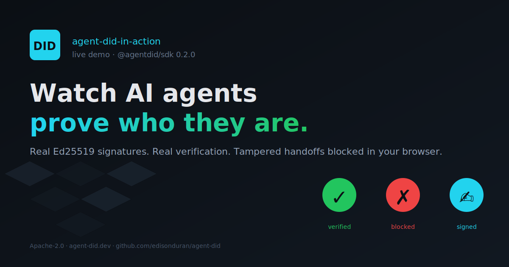

# Agent-DID in Action: Live Agent Identity Demo Gallery

> **Watch AI agents prove who they are, and catch tampering live.** Browser-only demo gallery for [Agent-DID](https://github.com/edisonduran/agent-did), built on the real [`@agentdid/sdk`](https://www.npmjs.com/package/@agentdid/sdk).

[](LICENSE)
[](https://www.npmjs.com/package/@agentdid/sdk)
[](https://github.com/edisonduran/agent-did-in-action/actions/workflows/ci.yml)



---

## Start here

| If you want to... | Start with |
|---|---|
| understand the protocol | [Read the RFC](https://github.com/edisonduran/agent-did/blob/main/docs/RFC-001-Agent-DID-Specification.md) |
| run the gallery in 2 minutes | [Open Quick start](#quick-start) |
| contribute a demo | [Read CONTRIBUTING.md](CONTRIBUTING.md) and [docs/DEMO-SPEC.md](docs/DEMO-SPEC.md) |
| claim an idea from the backlog | [Open the recommended demo backlog](CONTRIBUTING.md#recommended-demo-backlog) |
| use the SDK directly | [Install `@agentdid/sdk`](https://www.npmjs.com/package/@agentdid/sdk) |

---

## Why this gallery is different

- Real cryptography: the demos generate Ed25519 keys and W3C DID documents in the browser and verify signatures with `@agentdid/sdk`.
- Real failure modes: every scenario includes attacker mode so you can watch tampered or replayed handoffs get blocked live.
- Real contribution bar: manifests, demo contracts, bundle budgets, and smoke coverage are enforced in CI.
- Real breadth: the same trust model is shown across commerce, logistics, media provenance, healthcare recalls, and launch operations.

---

## What this repo is

Agent-DID in Action is the public demo gallery for Agent-DID. It is not a slide
deck, a static explainer, or a toy animation. Each scenario lazy-loads a real
interactive demo with signed handoffs, verification events, attacker mode,
blocked traces, and contributor-facing metadata.

The current UI opens on the Plaza gallery, where every card includes hero art,
tags, a problem statement, and a deep-linkable route. Opening a card switches
into a full demo view with its own HUD, use-case narrative, attacker model, and
live verification trace.

## Demo gallery

| Demo | Flow | What attacker mode proves |
|---|---|---|
| **The Plaza Shopping Mall** | shopper -> store -> payment bot | A forged Store -> Payment signature must be rejected. |
| **Cold-chain Supply Bots** | factory -> courier -> receiver | A relay cannot mutate a signed manifest and still pass verification. |
| **Newsroom Publish Chain** | reporter -> fact-checker -> editor -> publisher | Editorial approval is useless if a cleared revision can be altered downstream. |
| **Pharma Recall Cascade** | manufacturer -> regulator -> wholesaler -> pharmacy | Recall scope cannot be silently shrunk or expanded mid-chain. |
| **Spaceport Launch Window** | weather -> range safety -> flight control -> launch gate | A corrupted final-hop clearance must not open a launch window. |

Across all five demos, the cryptography is real: Ed25519 keys and W3C DID
documents are generated in the browser, signatures are verified with
`@agentdid/sdk`, and blocked handoffs surface the actual reason. There is no
blockchain, no RPC, no gas, and no persistence.


---

## Why it matters

Most AI agent demos stop at orchestration. This one focuses on identity and
integrity: can the receiving side prove who signed the message, and can it prove
the payload was not altered in transit?

That question shows up in more than one domain. Payments need it. Supply chains
need it. Media approval chains need it. Safety-critical recalls need it. Launch
operations need it. The gallery makes that argument with working demos instead
of abstract diagrams.

The demos run on the same package you can install today:

```bash
npm install @agentdid/sdk
```

Read the spec: [RFC-001 Agent-DID Specification](https://github.com/edisonduran/agent-did/blob/main/docs/RFC-001-Agent-DID-Specification.md).

---

## Quick start

Requires Node 20+.

```bash
git clone https://github.com/edisonduran/agent-did-in-action.git
cd agent-did-in-action
npm install
npm run dev      # http://localhost:5173
```

Useful deep links while developing:

- `http://localhost:5173/?demo=shopping-mall`
- `http://localhost:5173/?demo=supply-chain`
- `http://localhost:5173/?demo=newsroom-publish-chain`
- `http://localhost:5173/?demo=pharma-recall-cascade`
- `http://localhost:5173/?demo=spaceport-launch-window`

Production build + static preview:

```bash
npm run build
npm run preview  # http://localhost:4173
```

Core checks:

```bash
npm run lint     # tsc --noEmit
npm run validate:demos
npm test -- --run
npm run smoke    # node-side SDK smoke
npm run build
npm run check:bundles
```

End-to-end (requires `npx playwright install chromium`):

```bash
npm run test:e2e:install
npm run test:e2e
```

---

## Quality bar

CI enforces the same contract on every PR and push to `main`:

- typecheck
- demo manifest and contract validation
- unit tests
- Node-side SDK smoke
- production build
- per-demo bundle cap (`150 KB gz`)
- Playwright smoke

This matters because the gallery is intentionally open to community demos, but
the baseline quality bar is not negotiable.

---

## Telemetry

Production builds opt into [Plausible](https://plausible.io) when the env vars
are set at build time:

```bash
VITE_PLAUSIBLE_DOMAIN=plaza.agent-did.dev
VITE_PLAUSIBLE_SCRIPT=https://plausible.io/js/script.js   # optional override
```

Without them, every event is routed to `console.debug` so you can validate the
funnel locally. The current event names are listed in
[`src/telemetry/plausible.ts`](src/telemetry/plausible.ts) and mirror
`_bmad-output/planning-artifacts/demo-launch-plan.md §3.2`.

---

## Tech stack

| Layer | Choice | Why |
|---|---|---|
| Bundler / dev server | [Vite](https://vitejs.dev) 5 | Fast HMR, clean static build |
| UI | React 18 + TypeScript 5 | Familiar, type-safe gallery shell |
| Scene | [PixiJS](https://pixijs.com) 8 | WebGL isometric tiles + sprites |
| SDK | [`@agentdid/sdk`](https://www.npmjs.com/package/@agentdid/sdk) 0.2.0 | The real published package — no mocks |
| Tests | Vitest + Playwright | Unit + cross-browser smoke |
| Hosting | Static (Vercel) | Zero backend |

---

## Repository layout

```
agent-did-in-action/
├── public/                 ← favicon, OG image, hero art, sprites
├── src/
│   ├── App.tsx             ← gallery state, active demo shell, HUD + modal wiring
│   ├── demos/              ← manifests, registry, and lazy-loaded demo modules
│   ├── main.tsx            ← React + telemetry bootstrap
│   ├── scene/              ← PixiJS scene + isometric grid
│   ├── sim/                ← engine, runtime, scenarios (pure TS, unit-tested)
│   ├── telemetry/          ← Plausible wrapper
│   └── ui/                 ← Header / Hud / TraceInspector / BlockedModal
├── tests/                  ← vitest unit + ui tests
├── tests-e2e/              ← Playwright cross-browser smoke
├── scripts/                ← smoke, manifest validation, bundle guardrails
├── docs/                   ← demo contract and contributor-facing docs
├── vercel.json             ← deploy config + caching headers
└── .github/workflows/ci.yml
```

---

## Related

- 🏛️ **Main repo & RFC-001 spec**: <https://github.com/edisonduran/agent-did>
- 📦 **TypeScript SDK on npm**: <https://www.npmjs.com/package/@agentdid/sdk>
- 🐍 **Python SDK on PyPI**: <https://pypi.org/project/agent-did-sdk/>

---

## Contributing a demo

The gallery is open for community demos, but the contribution path is now much
stricter than the original prototype. That is intentional.

Start here:

- Read [`docs/DEMO-SPEC.md`](docs/DEMO-SPEC.md) — the binding spec.
- Follow the quick start in [`CONTRIBUTING.md`](CONTRIBUTING.md).
- Need an idea? Pick one from the recommended demo backlog in [`CONTRIBUTING.md`](CONTRIBUTING.md#recommended-demo-backlog).
- Open a PR with [`.github/PULL_REQUEST_TEMPLATE/demo.md`](.github/PULL_REQUEST_TEMPLATE/demo.md).
- Before opening the PR, run `npm run validate:demos`, `npm run lint`, `npm test -- --run`, `npm run build`, and `npm run check:bundles`.

Required surface (TypeScript-enforced + CI-checked): every demo declares
a `useCase`, a `codeSnippet` per agent, and an `attacker` whenever the
scenario reacts to attacker mode. Bundle cap: 150 KB gz per demo chunk.

If you just want to browse candidate scenarios before building, start with the
recommended backlog in [`CONTRIBUTING.md`](CONTRIBUTING.md#recommended-demo-backlog).

---

## License

[Apache-2.0](LICENSE) — same as the SDK and the spec.
